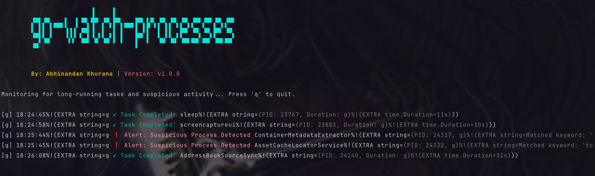
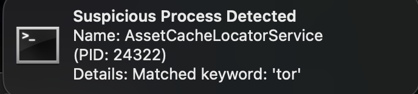

# ⚙️ Advanced Process Monitor CLI

An intelligent, cross-platform command-line tool that monitors system processes and provides meaningful desktop notifications for events that matter. Forget the noise; get alerted only for long-running tasks, high resource usage, and suspicious activity.

### Screenshots




---

## ✨ Core Features

- **🧠 Intelligent Notifications**: Only get notified when a task running for **more than 10 seconds** completes. Perfect for monitoring builds, scripts, and long commands.
- **🚨 Advanced Alerts**:
  - **High CPU Usage**: Get an alert if a process consumes high CPU for a sustained period.
  - **Suspicious Name Detection**: Be notified if a process starts with a name commonly associated with malware or miners (e.g., `miner`, `keylog`).
- **🔇 Smart Filtering**: Automatically ignores common, noisy background processes like `Google Chrome Helper`, `mdworker`, and `Code Helper` to keep your notifications relevant.
- **🖥️ Cross-Platform**: Works seamlessly on **macOS** and **Linux**. The core application runs on Windows, but desktop notifications are currently limited to macOS/Linux.
- **💅 Polished Interface**: A clean and beautiful terminal UI built with `Bubble Tea` that displays a live log of important events.

## 🚀 Installation

This tool relies on native command-line notifiers for each OS. Please ensure they are installed first.

#### 1. Install Notification Dependencies

- **On macOS** (using [Homebrew](https://brew.sh/)):

  ```sh
  brew install terminal-notifier
  ```

  _(The tool will prompt you to do this on first run if it's missing.)_

- **On Linux** (Debian/Ubuntu):

  ```sh
  sudo apt-get update && sudo apt-get install libnotify-bin
  ```

  _(For other distributions like Fedora/CentOS, use `sudo yum install libnotify`.)_

#### 2. Install the go-watch-processes

- **From Source:**

  ```bash
  git clone https://github.com/Abhinandan-Khurana/go-watch-processes.git
  cd go-watch-processes
  go build
  ```

- **From Releases:**
  Head over to the [**Releases**](https://github.com/Abhinandan-Khurana/go-watch-processes/releases) page to download a pre-compiled binary for your operating system.

- **Direct Installation using golang:**

```bash
go install -v github.com/Abhinandan-Khurana/go-watch-processes@latest
```

## ▶️ Usage

Simply run the executable from your terminal.

```bash
./go-watch-processes
```

The tool will take over the terminal window to display its event log. Leave it running in the background to monitor your system.

Press `q` or `Ctrl+C` to quit.

**Example TUI Output:**

```

                        ▐     ▌
        ▞▀▌▞▀▖▄▄▖▌  ▌▝▀▖▜▀ ▞▀▖▛▀▖▄▄▖▛▀▖▙▀▖▞▀▖▞▀▖▞▀▖▞▀▘▞▀▘▞▀▖▞▀▘
        ▚▄▌▌ ▌   ▐▐▐ ▞▀▌▐ ▖▌ ▖▌ ▌   ▙▄▘▌  ▌ ▌▌ ▖▛▀ ▝▀▖▝▀▖▛▀ ▝▀▖
        ▗▄▘▝▀     ▘▘ ▝▀▘ ▀ ▝▀ ▘ ▘   ▌  ▘  ▝▀ ▝▀ ▝▀▘▀▀ ▀▀ ▝▀▘▀▀


        By: Abhinandan Khurana | Version: v1.0.0

Monitoring for long-running tasks and suspicious activity... Press 'q' to quit.

[g] 18:24:45%!(EXTRA string=g ✔ Task Completed: sleep%!(EXTRA string=(PID: 23767, Duration: g)%!(EXTRA time.Duration=11s)))
[g] 18:24:58%!(EXTRA string=g ✔ Task Completed: screencaptureui%!(EXTRA string=(PID: 23883, Duration: g)%!(EXTRA time.Duration=10s)))
[g] 18:25:44%!(EXTRA string=g ❗ Alert: Suspicious Process Detected ContainerMetadataExtractor%!(EXTRA string=(PID: 24317, g)%!(EXTRA string=Matched keyword: '
[g] 18:25:45%!(EXTRA string=g ❗ Alert: Suspicious Process Detected AssetCacheLocatorService%!(EXTRA string=(PID: 24322, g)%!(EXTRA string=Matched keyword: 'to
[g] 18:26:08%!(EXTRA string=g ✔ Task Completed: AddressBookSourceSync%!(EXTRA string=(PID: 24240, Duration: g)%!(EXTRA time.Duration=31s)))
[g] 18:26:35%!(EXTRA string=g ✔ Task Completed: %!(EXTRA string=(PID: 24458, Duration: g)%!(EXTRA time.Duration=31s)))
[g] 18:26:42%!(EXTRA string=g ✔ Task Completed: screencaptureui%!(EXTRA string=(PID: 24055, Duration: g)%!(EXTRA time.Duration=1m33s)))
[g] 18:26:42%!(EXTRA string=g ✔ Task Completed: %!(EXTRA string=(PID: 24422, Duration: g)%!(EXTRA time.Duration=44s)))
```

## 🔧 Configuration

The list of ignored processes and suspicious keywords are currently hardcoded for simplicity. To customize them, modify the `ignoreList` and `suspiciousKeywords` variables at the top of the `monitor/watcher.go` file and re-build the application.

```go
// monitor/watcher.go

var ignoreList = []string{
 "Google Chrome Helper",
 "mdworker_shared",
 // Add your custom ignored processes here
}

var suspiciousKeywords = []string{"miner", "keylog", "tor", /* ... */}
```
